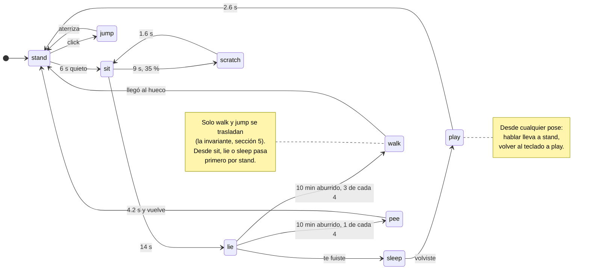
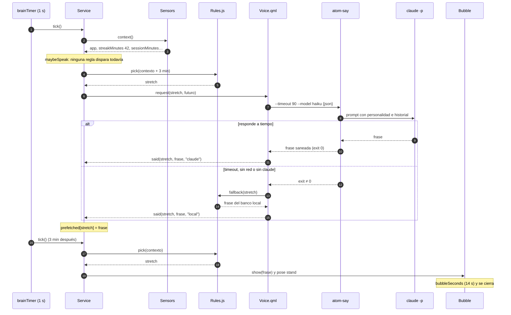
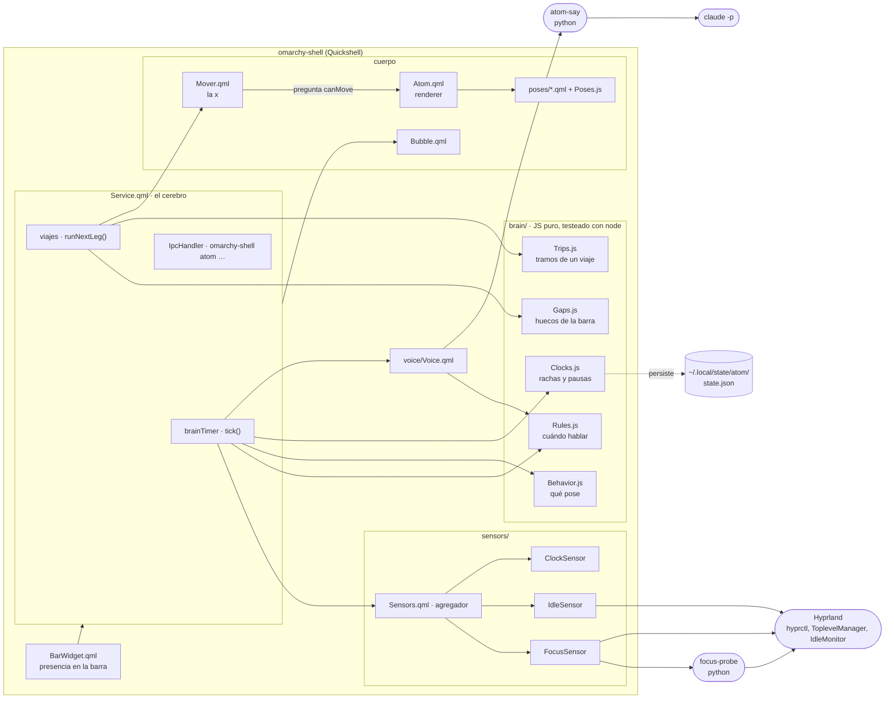
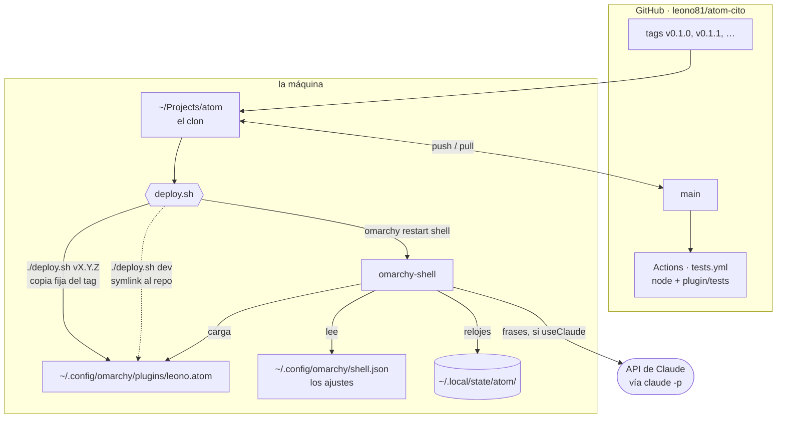
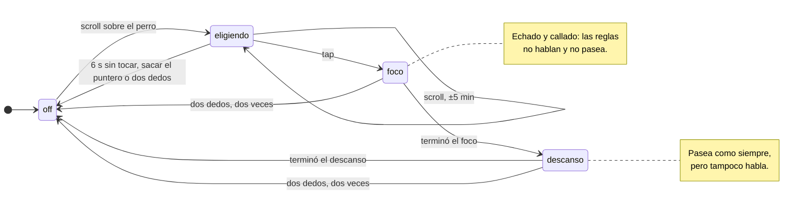

# Diagramas

Cuatro vistas de Atom en UML, escritas en [Mermaid](https://mermaid.js.org/)
para que GitHub las dibuje y vivan en el mismo diff que el código. Si cambiás
lo que muestra un diagrama, se actualiza en el mismo PR.

| Diagrama | Responde | Fuente de verdad |
|---|---|---|
| [Estados](#1-estados-qué-pose-cuándo) | ¿qué pose toca y por qué? | `brain/Behavior.js` (`IDLE`) y `Service.qml` (viajes, click) |
| [Secuencia](#2-secuencia-cómo-decide-hablar) | ¿cómo llega una frase al globo? | `Service.qml` (`maybeSpeak`, `maybePrefetch`), `voice/` |
| [Componentes](#3-componentes-quién-conoce-a-quién) | ¿quién conoce a quién? | `plugin/` |
| [Despliegue](#4-despliegue-dónde-corre-cada-cosa) | ¿dónde corre cada cosa? | `deploy.sh`, `manifest.json` |
| [Pomodoro](#5-pomodoro-solo-si-lo-pedís) | ¿cómo se elige y qué hace? | `brain/Pomodoro.js`, `Service.qml` |

La prosa con el porqué de cada decisión sigue en [ARQUITECTURA.md](ARQUITECTURA.md).

## 1. Estados: qué pose cuándo

El cerebro evalúa la tabla `IDLE` una vez por segundo (`brainTimer`) y gana la
primera fila que aplica. Los tiempos son cuánto lleva en la pose actual.

Detalles que el dibujo simplifica:

- **El click no está en la tabla.** Tiene que responder al instante y la
  tabla corre una vez por segundo, así que lo maneja `Service.onDemand()`: la
  cabriola sale desde cualquier pose y además pide una frase. Dos
  excepciones: si está mudo, el click solo lo despierta (ni salto ni frase);
  si ya está hablando, salta pero no pide otra.
- **El pis reemplaza al paseo, no lo sigue.** Cuando la tabla pide `walk`,
  una de cada cuatro veces `Service` intenta `goPee()` en su lugar, y si no
  hay dónde, pasea.
- **`walk` es un viaje, no una pose suelta.** `Trips.js` arma los tramos
  (mudarse de hueco, punta a punta, la vuelta por el borde, la ronda, la
  corrida) y `Service.runNextLeg()` los ejecuta. Al terminar el último tramo
  vuelve a `stand`.
- **`pee` y `jump` también son viajes**: `pee` se queda 4.2 s en el lugar y
  vuelve a un hueco; `jump` es la cabriola, un salto y un rebote.

## 2. Secuencia: cómo decide hablar

El caso normal: la regla `stretch` va a disparar a los 45 minutos y la frase
se pide 3 minutos antes, para que el globo salga sin esperar a Claude.

Lo que no se ve en el dibujo:

- **Antes de `pick` hay cuatro filtros**: si está mudo, si estás lejos del
  teclado, si el globo todavía está abierto, o si habló hace menos de
  `quietMinutes` (20), no habla. En el último caso igual aprovecha para
  anticipar.
- **Si la frase no estaba lista** cuando la regla dispara, se pide en el
  momento y el globo sale cuando llegue. Es el mismo camino que sigue el click
  (regla `ondemand`).
- **Con `useClaude: false`**, `Voice` va directo al banco local sin lanzar
  ningún proceso.

## 3. Componentes: quién conoce a quién

UML tiene un diagrama de componentes, pero Mermaid no; este es un flowchart
con la misma idea. Las flechas son "usa" o "le habla a".

Las reglas que el dibujo debería dejar claras:

- **`brain/` no importa QML.** Por eso se testea con `node` pelado y por eso
  el CI no necesita una barra.
- **El renderer no conoce ninguna pose por su nombre**: carga lo que diga
  `Poses.js`. El `Mover` le pregunta a la pose activa si puede trasladarse.
- **Los dos procesos externos son de Python y nunca fallan hacia arriba**:
  ante un problema, `focus-probe` imprime `{}` y `atom-say` sale con error,
  y en los dos casos Atom sigue con lo que tiene.

## 4. Despliegue: dónde corre cada cosa

- **Lo que corre en la barra es siempre un tag**, salvo en modo `dev`.
  `./deploy.sh` a secas dice cuál.
- **El estado vive afuera del plugin**, así que cambiar de versión, o volver a
  una anterior, no pierde los relojes.
- **Lo único que sale de la máquina** es el pedido de frase a Claude, y se
  apaga con `useClaude: false`. Ver [privacidad](../MANIFIESTO.md#7-privacidad).

## 5. Pomodoro: solo si lo pedís

Dos máquinas: el selector, que dura unos segundos mientras elegís, y el ciclo.
Atom nunca entra a ninguna de las dos por su cuenta.

- **El estado se guarda** en `~/.local/state/atom/pomodoro.json`, así que un
  reinicio del shell no corta el foco. Si las dos etapas terminaron con el
  shell apagado, pasa a `off` sin anunciar nada.
- **Ladra** al arrancar (`bark-ok`), dos veces al terminar el foco y una al
  terminar el descanso (`bark-alert`), con `pw-play`. En mudo, no.
- **Las frases son fijas** y viven en `Pomodoro.js`: la cancelación pasa en el
  momento y no da tiempo a pedirle nada a Claude.
- **Con el puntero encima se queda quieto**, incluso a mitad de un paseo: un
  blanco de 28 px que camina es imposible de agarrar con touchpad. Para eso el
  área sensible lo sigue a 4 Hz mientras camina, y mientras elegís se agranda
  a perro + selector.
